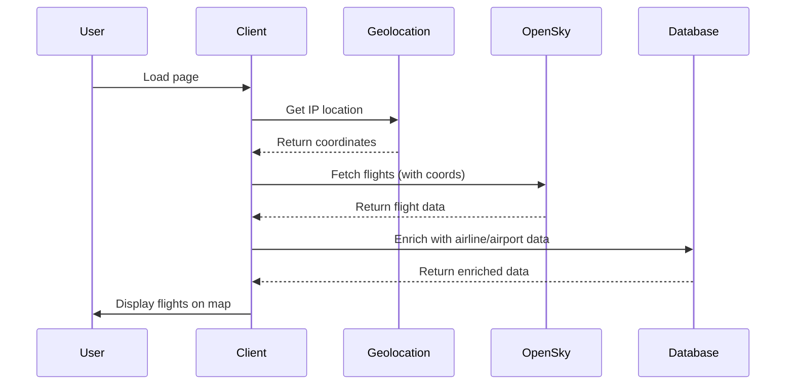
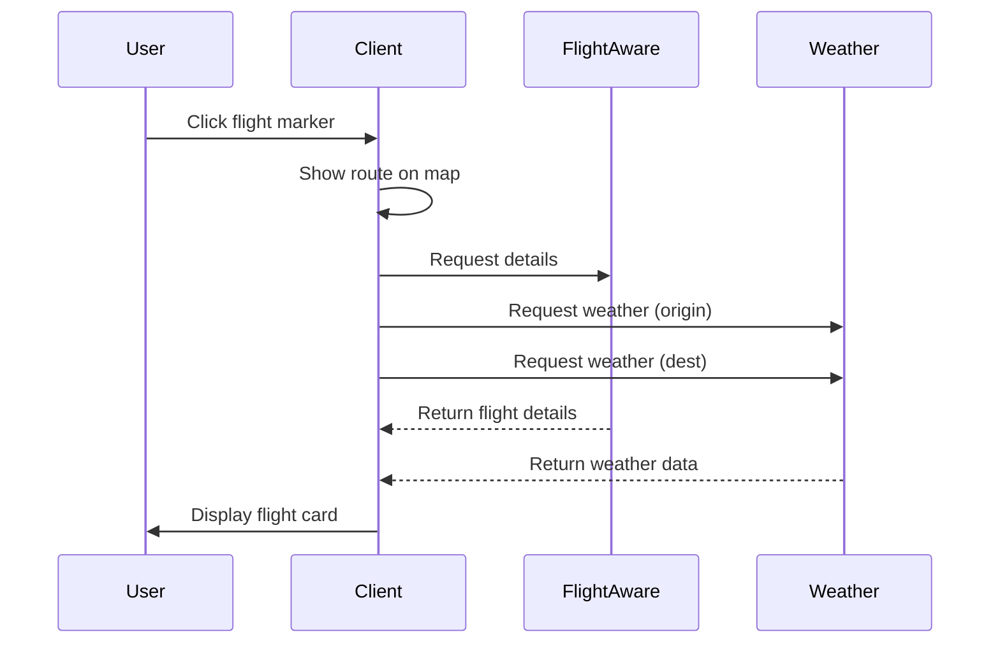

# FlightTracker Architecture Guide

## System Overview

The FlightTracker is a comprehensive real-time flight tracking system built with React, Next.js, and multiple data sources. This document outlines the complete architecture, data flow, and implementation details.

## Architecture Components

### 1. Data Layer

#### Primary Data Sources
- **OpenSky Network API**
  - Real-time aircraft positions
  - OAuth2 authentication for higher limits
  - 30-60 second update intervals
  - Position, altitude, velocity, heading data

- **FlightAware Web Scraper**
  - Detailed flight information
  - Gate assignments and times
  - Aircraft type and registration
  - Scheduled vs actual times
  - 5-minute cache policy

- **OpenWeatherMap API**
  - Current weather at airports
  - Temperature, conditions, icons
  - Wind speed and humidity

- **IP-API Geolocation**
  - IP-based user location
  - No browser permissions needed
  - Fallback to default location

#### Database Collections
- **Airlines**: 6,162 records with IATA/ICAO codes
- **Airports**: 10,000+ with coordinates and timezones
- **Routes**: 67,663 flight routes
- **Flight-cache**: Temporary storage for enriched data

### 2. Server-Side Architecture

#### API Routes Structure
```
/api/
├── flights/
│   ├── route.ts           # Main OpenSky API endpoint
│   ├── flightaware/       # Scraper endpoint
│   ├── search/            # Flight search
│   └── enrich/            # Data enrichment
├── geolocation/
│   └── route.ts           # IP-based location
└── weather/
    └── route.ts           # Weather data
```

#### Caching Strategy
```typescript
// Cache durations
const CACHE_DURATIONS = {
  OPENSKY_AUTH: 25,      // 25 seconds (authenticated)
  OPENSKY_ANON: 45,      // 45 seconds (anonymous)
  FLIGHTAWARE: 300,      // 5 minutes
  WEATHER: 300,          // 5 minutes
  DATABASE: 1800         // 30 minutes
}
```

#### OAuth2 Token Management
```typescript
// Token lifecycle
interface OAuthToken {
  token: string
  expiresAt: number
}

// Auto-refresh before expiry
const refreshBuffer = 300000 // 5 minutes
```

### 3. Client-Side Architecture

#### Component Hierarchy
```
FlightTracker
├── FlightMap2D
│   └── MapboxMap
│       ├── Markers (GSAP animated)
│       ├── Routes (GeoJSON)
│       └── Controls
├── FlightCard
│   ├── FlightSummary
│   ├── DepartureTimes
│   ├── ArrivalTimes
│   ├── FlightProgress
│   └── WeatherInfo
└── FlightSearch
```

#### State Management
```typescript
// Core state
const [flights, setFlights] = useState<Flight[]>([])
const [selectedFlight, setSelectedFlight] = useState<Flight | null>(null)
const [mapCenter, setMapCenter] = useState<Coordinates>(defaultLocation)

// Animation refs
const flightAnimationRefs = useRef<Map<string, gsap.core.Tween>>()
const markers = useRef<Map<string, mapboxgl.Marker>>()
```

### 4. Animation System

#### GSAP Integration
The animation system decouples visual updates from API polling:

```typescript
// Position prediction
const predictPosition = (flight: Flight, deltaTime: number) => {
  const distance = flight.velocity * deltaTime
  return turf.destination(
    [flight.longitude, flight.latitude],
    distance,
    flight.true_track
  )
}

// Smooth interpolation
gsap.to(animatedPos, {
  lat: predictedPosition.lat,
  lng: predictedPosition.lng,
  duration: UPDATE_INTERVAL / 1000,
  ease: "none",
  onUpdate: () => marker.setLngLat([animatedPos.lng, animatedPos.lat])
})
```

#### Animation Timeline
1. **T+0s**: Receive new position from API
2. **T+0.1s**: Calculate predicted position
3. **T+0.2s**: Start GSAP animation
4. **T+30s**: Animation reaches predicted position
5. **T+30s**: New API data arrives, repeat

### 5. Data Flow

#### Initial Load Sequence


#### Flight Selection Flow


## Implementation Details

### Position Prediction Algorithm
```typescript
function predictFlightPosition(
  flight: Flight,
  deltaTimeMs: number
): [number, number] {
  if (!flight.velocity || !flight.true_track || flight.on_ground) {
    return [flight.longitude, flight.latitude]
  }
  
  // Convert velocity from m/s to km/h
  const velocityKmPerHour = flight.velocity * 3.6
  
  // Calculate distance traveled
  const distanceKm = velocityKmPerHour * (deltaTimeMs / 3600000)
  
  // Use Turf.js for accurate Earth calculations
  const currentPoint = turf.point([flight.longitude, flight.latitude])
  const destination = turf.destination(
    currentPoint,
    distanceKm,
    flight.true_track,
    { units: 'kilometers' }
  )
  
  return destination.geometry.coordinates
}
```

### Marker Management
```typescript
// Efficient marker updates
const updateMarkers = (flights: Flight[]) => {
  const currentIds = new Set(flights.map(f => f.icao24))
  
  // Add/update markers
  flights.forEach(flight => {
    let marker = markers.get(flight.icao24)
    
    if (!marker) {
      // Create new marker
      marker = createMarker(flight)
      markers.set(flight.icao24, marker)
    } else {
      // Update existing with animation
      animateMarker(marker, flight)
    }
  })
  
  // Remove old markers
  markers.forEach((marker, id) => {
    if (!currentIds.has(id)) {
      marker.remove()
      markers.delete(id)
    }
  })
}
```

### FlightAware Scraper
```typescript
// Intelligent data extraction
const scrapeFlightAware = async (callsign: string) => {
  // Check cache first
  const cached = await checkCache(callsign)
  if (cached) return cached
  
  // Fetch page with browser headers
  const response = await fetch(url, {
    headers: browserHeaders
  })
  
  const $ = cheerio.load(await response.text())
  
  // Try JSON extraction first
  const jsonData = extractJsonData($)
  if (jsonData) return parseJsonData(jsonData)
  
  // Fallback to HTML parsing
  return parseHtmlData($)
}
```

## Performance Optimizations

### 1. Network Optimization
- **Request Batching**: Combine multiple data requests
- **Caching**: Multi-level caching (memory, database)
- **Compression**: GZip for API responses
- **CDN**: Static assets via Cloudflare

### 2. Rendering Optimization
- **Virtual DOM**: React reconciliation
- **Marker Pooling**: Reuse DOM elements
- **RAF**: RequestAnimationFrame for animations
- **Lazy Loading**: Dynamic imports for maps

### 3. Memory Management
- **Cleanup**: Proper disposal of animations
- **WeakMaps**: For temporary references
- **Limits**: Max 200 flights displayed
- **Throttling**: Update batching

## Error Handling

### API Failures
```typescript
try {
  const data = await fetchFlights()
  processData(data)
} catch (error) {
  // Fallback to cached data
  const cached = getCachedFlights()
  if (cached) {
    displayCached(cached)
  } else {
    showError('Unable to load flights')
  }
}
```

### Rate Limiting
```typescript
// Exponential backoff
let retryDelay = 1000
const maxRetries = 5

async function fetchWithRetry(url: string, attempt = 0) {
  try {
    return await fetch(url)
  } catch (error) {
    if (attempt < maxRetries) {
      await sleep(retryDelay)
      retryDelay *= 2
      return fetchWithRetry(url, attempt + 1)
    }
    throw error
  }
}
```

## Security Considerations

### API Key Management
- Environment variables only
- Server-side proxy for all APIs
- No client-side exposure
- Rate limit enforcement

### Data Validation
- Input sanitization
- Type checking
- Range validation
- SQL injection prevention

### CORS Policy
```typescript
// API route headers
headers: {
  'Access-Control-Allow-Origin': process.env.ALLOWED_ORIGINS,
  'Access-Control-Allow-Methods': 'GET, POST',
  'X-Content-Type-Options': 'nosniff',
  'X-Frame-Options': 'DENY'
}
```

## Monitoring & Analytics

### Performance Metrics
- API response times
- Animation frame rates
- Cache hit rates
- Error frequencies

### User Analytics
- Flight searches
- Popular routes
- Feature usage
- Session duration

### Health Checks
```typescript
// Endpoint health monitoring
const healthChecks = {
  opensky: checkOpenSkyAPI(),
  flightaware: checkFlightAwareScraper(),
  weather: checkWeatherAPI(),
  database: checkDatabaseConnection()
}
```

## Deployment Considerations

### Environment Setup
```bash
# Required environment variables
OPENSKY_CLIENT_ID=xxx
OPENSKY_CLIENT_SECRET=xxx
OPENWEATHERMAP_API_KEY=xxx
NEXT_PUBLIC_MAPBOX_TOKEN=xxx
DATABASE_URI=xxx
```

### Scaling Strategy
- Horizontal scaling for API routes
- CDN for static assets
- Database replication
- Redis for shared cache

### Monitoring Tools
- Sentry for error tracking
- Vercel Analytics for performance
- Uptime monitoring for APIs
- CloudWatch for AWS resources

## Testing Strategy

### Unit Tests
```typescript
describe('FlightTracker', () => {
  test('predicts position correctly', () => {
    const flight = mockFlight()
    const predicted = predictPosition(flight, 30000)
    expect(predicted).toBeCloseTo(expectedPosition)
  })
})
```

### Integration Tests
- API endpoint testing
- Database operations
- Cache functionality
- Authentication flow

### E2E Tests
- User workflows
- Map interactions
- Search functionality
- Error scenarios

## Future Roadmap

### Short Term (Q1 2025)
- WebSocket for real-time updates
- Mobile app development
- Enhanced search filters
- Flight history tracking

### Medium Term (Q2-Q3 2025)
- 3D globe visualization
- Airport detail pages
- Airline statistics
- Multi-language support

### Long Term (Q4 2025+)
- AI-powered predictions
- Weather overlay maps
- Flight delay predictions
- Social features

## Conclusion

The FlightTracker system represents a sophisticated integration of multiple data sources, real-time processing, and smooth client-side animations. The architecture prioritizes user experience through intelligent caching, predictive animations, and graceful error handling while maintaining high performance and reliability.
